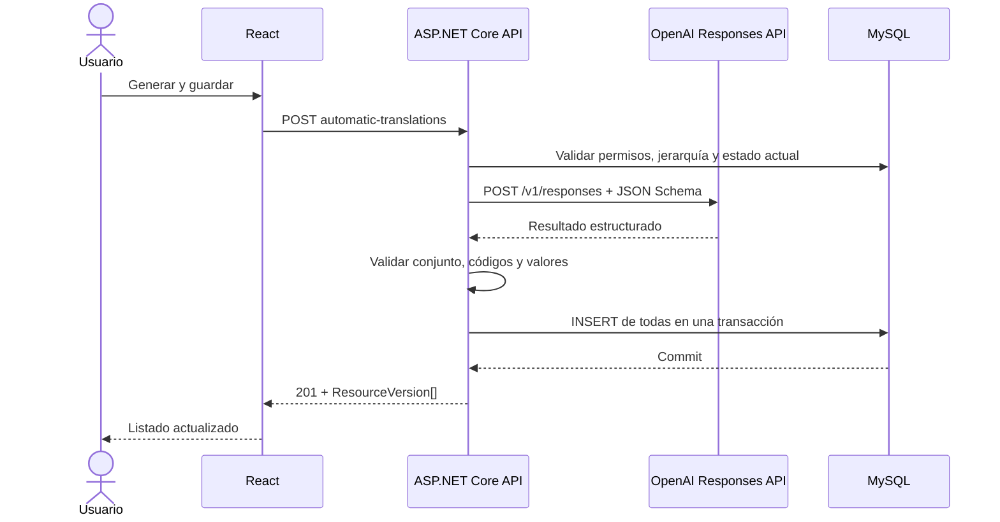

# 05 — Traducciones automáticas con OpenAI

## 1) Objetivo

Permitir que un usuario genere y guarde de una sola vez las traducciones que faltan en un recurso, tomando como origen una traducción existente.

La solución consume OpenAI Responses API directamente desde el backend ASP.NET Core. No mantiene una conversación, no habilita herramientas y no concede a OpenAI acceso a la base de datos.

> Nota terminológica: la aplicación no automatiza la interfaz de ChatGPT. Consume un modelo GPT mediante la API de OpenAI, un producto con cuenta, credenciales y facturación independientes.

## 2) Alcance funcional

### Incluido

- Botón **Añadir traducciones automáticas** en la vista de traducciones del recurso.
- Selección manual de una traducción existente como texto e idioma de origen.
- Generación de todos los idiomas del catálogo que todavía no existen en el recurso.
- Guardado inmediato y atómico de todas las traducciones generadas.
- Autenticación del backend mediante una API key de un proyecto OpenAI.
- Trazas técnicas y métricas sin registrar el contenido de las traducciones.

### Fuera de alcance

- Editar o aprobar las traducciones antes de guardarlas.
- Traducir solo una parte de los idiomas pendientes.
- Sobrescribir traducciones existentes.
- Memoria de traducción, glosarios, detección automática del idioma o revisión editorial.
- Conversaciones, herramientas externas, RAG o acceso de OpenAI a MySQL.
- Invocación de OpenAI directamente desde el navegador.

## 3) Experiencia de usuario

1. La vista `/projects/{projectId}/{pageId}/{pageVersionId}/{resourceId}` mantiene la acción manual **Añadir traducción**.
2. Si existe al menos una traducción de origen y al menos un idioma pendiente, se muestra también **Añadir traducciones automáticas**.
3. Al pulsarlo se abre un modal que muestra:
   - selector obligatorio de idioma de origen, limitado a las traducciones existentes;
   - bandera, nombre y código del idioma seleccionado;
   - vista de solo lectura del valor que se enviará;
   - lista de idiomas de destino, calculada con los idiomas pendientes;
   - acciones **Generar y guardar** y **Cancelar**.
4. Al confirmar, el botón queda deshabilitado y muestra estado de carga hasta recibir la respuesta.
5. Si la operación finaliza correctamente, el modal se cierra y las nuevas traducciones aparecen inmediatamente en el listado.
6. Si ocurre cualquier error, el modal permanece abierto, no aparece ninguna traducción nueva y se muestra un mensaje recuperable.
7. Si ya no quedan idiomas pendientes, la acción automática no se muestra.

Los idiomas de destino nunca se eligen manualmente: siempre son todos los códigos soportados que aún no tienen una `ResourceVersion` activa.

## 4) Arquitectura



### Responsabilidades

- **Frontend**: selecciona el origen, presenta los destinos calculados por el estado actual y evita envíos duplicados mientras la petición está activa.
- **API**: es la autoridad sobre permisos, jerarquía, catálogo, idiomas pendientes, validación de la respuesta y persistencia.
- **Cliente OpenAI**: transforma una entrada estructurada en traducciones estructuradas mediante Responses API. No decide destinos ni persiste datos.
- **Modelo GPT**: se selecciona mediante configuración del backend y genera una única respuesta JSON ajustada a un esquema estricto.
- **Base de datos**: conserva la restricción única de traducción activa por `(resourceId, languageCode)`.

La petición usa `store: false`, no envía `previous_response_id`, no declara herramientas y exige Structured Outputs mediante `text.format` con JSON Schema estricto.

## 5) Contratos

### Endpoint de aplicación

`POST /api/v1/projects/{projectId}/pages/{pageId}/versions/{pageVersionId}/resources/{resourceId}/automatic-translations`

Petición:

```json
{
  "sourceLanguageCode": "es-es"
}
```

Respuesta correcta, `201 Created`:

```json
{
  "translations": [
    {
      "id": "00000000-0000-0000-0000-000000000000",
      "resourceId": "00000000-0000-0000-0000-000000000000",
      "languageCode": "pt-br",
      "value": "Olá",
      "createdAt": "2026-07-25T12:00:00Z",
      "updatedAt": "2026-07-25T12:00:00Z",
      "isDeleted": false
    }
  ]
}
```

El cliente solo envía el código de origen. La API obtiene el valor desde la base de datos y vuelve a calcular los destinos para impedir que un cliente manipule el texto o solicite idiomas ya existentes.

### Entrada lógica del cliente OpenAI

```json
{
  "sourceLanguageCode": "es-es",
  "sourceValue": "Hola",
  "targetLanguageCodes": ["pt-br", "en-uk"]
}
```

### Salida lógica del cliente OpenAI

```json
{
  "translations": [
    { "languageCode": "pt-br", "value": "Olá" },
    { "languageCode": "en-uk", "value": "Hello" }
  ]
}
```

La salida debe contener exactamente una traducción no vacía por código solicitado, sin códigos adicionales, duplicados ni texto fuera del JSON.

## 6) Reglas de traducción y validación

1. El origen debe ser una `ResourceVersion` activa del recurso indicado.
2. Los destinos se calculan después de validar el árbol y son la diferencia entre el catálogo soportado y los idiomas activos del recurso.
3. El idioma de origen nunca forma parte de los destinos.
4. La API rechaza la operación si no quedan idiomas pendientes.
5. El modelo debe conservar el significado, tono, mayúsculas, saltos de línea, variables de interpolación, marcadores y fragmentos técnicos.
6. El modelo no debe traducir nombres de variables, claves, etiquetas HTML ni placeholders como `{name}`, `{{count}}`, `%s` o `${value}`.
7. La API valida que la respuesta contiene exactamente el conjunto de destinos solicitado y que cada valor cumple las reglas de `ResourceVersion`.
8. Una respuesta parcial, mal formada o con destinos inesperados se descarta por completo.
9. Tras validar la respuesta, la API abre una transacción, vuelve a comprobar los idiomas activos, inserta todas las versiones y confirma una sola vez.
10. Un conflicto concurrente o cualquier fallo de persistencia revierte la transacción completa.

La llamada remota se realiza antes de abrir la transacción de base de datos. Así se conserva la atomicidad del guardado sin mantener bloqueos durante la inferencia.

## 7) Errores

| Estado | Condición | Comportamiento |
| --- | --- | --- |
| `400 Bad Request` | Origen no soportado, no pertenece al recurso o no quedan destinos | No se llama al agente ni se modifica la base de datos |
| `401 Unauthorized` | Usuario no autenticado | Se rechaza antes de consultar OpenAI |
| `403 Forbidden` | Usuario sin permiso de edición | Se rechaza antes de consultar OpenAI |
| `404 Not Found` | Algún ID no existe en el árbol solicitado | No se llama al agente |
| `409 Conflict` | Cambió el conjunto de idiomas durante la operación | Se revierte todo y el cliente debe recargar |
| `422 Unprocessable Entity` | OpenAI devuelve una salida completa pero con destinos o valores semánticamente inválidos | Se descarta toda la respuesta |
| `502 Bad Gateway` | OpenAI devuelve una respuesta fallida, incompleta, rechazada o no interpretable | No se guarda ninguna traducción |
| `503 Service Unavailable` | OpenAI no está configurado, limita peticiones, no está disponible o agota el tiempo | No se guarda ninguna traducción |

La API no reintenta automáticamente una generación para evitar costes duplicados y resultados distintos. El usuario puede volver a intentarlo desde el mismo modal.

## 8) Servicios y cuenta necesarios

| Elemento | Finalidad | Obligatorio |
| --- | --- | --- |
| Cuenta de OpenAI Platform | Administrar acceso y facturación de API | Sí |
| Proyecto OpenAI | Aislar credenciales, uso y límites | Sí |
| Saldo o facturación activa | Pagar los tokens consumidos | Sí, salvo créditos promocionales disponibles |
| API key de proyecto | Autenticar exclusivamente al backend | Sí |
| Secret manager del entorno | Guardar `OpenAI:ApiKey` fuera del repositorio | Sí |

No se necesita una suscripción ChatGPT, Azure, un agente, un contenedor adicional ni una base de datos nueva.

## 9) Configuración paso a paso de OpenAI

### 9.1 Preparar cuenta, proyecto y facturación

1. Entrar en [OpenAI Platform](https://platform.openai.com/) con la cuenta de la organización responsable.
2. Crear un proyecto específico por entorno o aplicación.
3. Activar la facturación de API o comprar saldo prepago. La suscripción de ChatGPT no incluye consumo de API.
4. Configurar un presupuesto y alertas de uso en el proyecto.
5. Seleccionar un modelo compatible con Responses API y Structured Outputs; el identificador se mantiene configurable como `OpenAI:Model`.

### 9.2 Crear y guardar la credencial

1. Crear una API key restringida al proyecto.
2. Guardarla en desarrollo con ASP.NET Core User Secrets:

```bash
read -s "OPENAI_API_KEY?Nueva OpenAI API key: " && printf '\n' && \
printf '{"OpenAI:ApiKey":"%s"}' "$OPENAI_API_KEY" | \
dotnet user-secrets set --project src/resources-api/resources-api.csproj && \
unset OPENAI_API_KEY
```

3. Introducir el valor en el prompt silencioso del terminal; no enviarlo por chat ni incluirlo en el historial del shell.
4. En producción, guardar la misma clave de configuración en el gestor de secretos del proveedor de alojamiento.
5. No guardar la clave en `appsettings*.json`, Dockerfiles, imágenes, logs, Git ni variables `VITE_*`.
6. Revocar y sustituir inmediatamente cualquier clave expuesta.

### 9.3 Configurar el backend

La configuración no secreta usa estas claves:

```json
{
  "OpenAI": {
    "BaseUrl": "https://api.openai.com/v1/",
    "Model": "<modelo-compatible-con-structured-outputs>",
    "TimeoutSeconds": 60,
    "MaxOutputTokens": 2000
  }
}
```

El backend registra un `HttpClient` tipado con la URL base y timeout configurados. Añade `Authorization: Bearer <OpenAI:ApiKey>` en cada llamada, sin registrar cabeceras ni cuerpos.

### 9.4 Construir la petición Responses API

1. Enviar `POST https://api.openai.com/v1/responses`.
2. Incluir `model`, instrucciones de traducción, la entrada lógica serializada como JSON en `input`, `store: false` y `max_output_tokens`.
3. No incluir `conversation`, `previous_response_id` ni herramientas.
4. Definir `text.format.type` como `json_schema`, `strict: true`, todos los campos como obligatorios y `additionalProperties: false` en cada objeto.
5. Procesar únicamente respuestas con estado `completed` y contenido `output_text`.
6. Tratar `refusal`, `incomplete`, errores HTTP y respuestas no interpretables según la sección 7.
7. Deserializar la salida y volver a validar códigos, cardinalidad y valores antes de persistir.

### 9.5 Verificación operativa

1. Ejecutar una traducción con los tres idiomas soportados y comprobar el esquema exacto.
2. Confirmar en el dashboard de OpenAI que la petición pertenece al proyecto correcto y registra consumo.
3. Forzar con un doble una salida parcial, duplicada, adicional y rechazada; ninguna debe insertar filas.
4. Probar sin `OpenAI:ApiKey`, con timeout y con respuesta `429`; la API debe devolver indisponibilidad sin filtrar credenciales ni detalles internos.
5. Revisar logs: duración, estado, modelo y consumo pueden registrarse, pero no los textos ni la clave.
6. Verificar presupuesto, alertas y procedimiento de rotación antes del despliegue productivo.

## 10) Seguridad, privacidad y costes

- Solo el backend llama a OpenAI y conoce la API key.
- La API autentica al usuario y comprueba permiso de edición antes de enviar contenido a OpenAI.
- Todas las llamadas usan TLS y la clave se obtiene del secret manager del entorno.
- Logs y trazas contienen IDs de correlación, idiomas, duración, estado y consumo, pero no `sourceValue` ni traducciones generadas.
- El agente no recibe nombres de usuario, emails, IDs de proyecto ni credenciales.
- Deben revisarse la residencia y política de tratamiento de los textos de OpenAI antes del paso a producción.
- `store: false` evita conservar la respuesta como recurso recuperable de Responses API, sin sustituir la revisión contractual de retención y privacidad.
- Un rechazo por filtros de seguridad se trata como fallo total.
- OpenAI factura tokens de entrada y salida; el proyecto debe tener presupuesto, alertas y límites acordes con el uso previsto.

## 11) Estrategia de pruebas

### Backend

- Rechaza usuarios sin permiso, jerarquías incoherentes y orígenes inexistentes antes de invocar el cliente OpenAI.
- Calcula destinos desde el catálogo y no desde la petición.
- Envía al cliente exactamente origen, valor y destinos pendientes.
- Guarda todas las traducciones válidas en una transacción.
- No guarda ninguna ante salida parcial, duplicada, extra, vacía o mal formada.
- Revierte todo ante conflicto concurrente o error de base de datos.
- Traduce errores y timeouts del cliente a los estados definidos sin filtrar tokens ni endpoints internos.

El cliente de OpenAI se abstrae detrás de una interfaz y se sustituye por un doble determinista en pruebas de integración; las suites normales no llaman a OpenAI ni generan coste.

### Cliente OpenAI

- Pruebas unitarias del JSON enviado: `store: false`, modelo configurado, instrucciones y esquema estricto.
- Pruebas de respuesta completada, `refusal`, estado incompleto, JSON inválido, timeout, `429` y `5xx`.
- Smoke test manual separado contra OpenAI antes de desplegar, sin formar parte de la suite ordinaria.

### Frontend

- Muestra la acción solo cuando existen origen y destinos.
- El modal lista únicamente traducciones existentes como origen y todos los idiomas pendientes como destinos.
- Deshabilita confirmación durante la petición y evita dobles envíos.
- Actualiza el listado y cierra el modal tras `201`.
- Mantiene el modal y el estado previo ante cualquier error.

## 12) Criterios de aceptación

- La vista de un recurso ofrece **Añadir traducciones automáticas** cuando corresponde.
- El usuario selecciona una traducción existente como origen dentro del modal.
- La API, no el navegador, determina todos los idiomas restantes.
- Una confirmación genera y guarda inmediatamente una traducción por cada idioma pendiente.
- Nunca se sobrescribe una traducción activa.
- El resultado se guarda completo o no se guarda ninguna traducción.
- El navegador no contiene credenciales ni llamadas directas a OpenAI.
- La API key solo existe en User Secrets o el secret manager del entorno y puede rotarse sin recompilar.
- La petición no dispone de conversación, herramientas externas ni acceso a MySQL.
- Las trazas operativas no contienen los textos enviados o generados.
- Pruebas backend, contrato del cliente OpenAI, frontend, build y lint quedan en verde.

## 13) Referencias oficiales

- [Create a response](https://developers.openai.com/api/reference/resources/responses/methods/create)
- [Structured model outputs](https://developers.openai.com/api/docs/guides/structured-outputs)
- [Production best practices](https://developers.openai.com/api/docs/guides/production-best-practices)
- [API billing is separate from ChatGPT](https://help.openai.com/en/articles/8156019-how-can-i-move-my-chatgpt-subscription-to-the-api)
- [Prepaid billing](https://help.openai.com/en/articles/8264778-what-is-prepaid-billing)