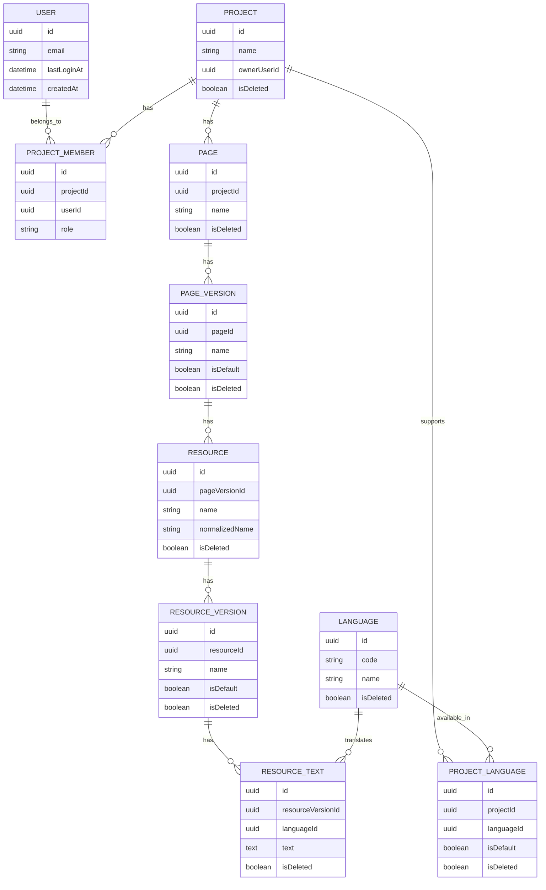

# Especificaciones funcionales priorizadas — Gestor de recursos (versión simplificada)

## 1) Objetivo del producto

Construir un software para centralizar la gestión de textos de interfaz (resources), su versionado, su localización por idioma y su reutilización entre páginas/proyectos, con colaboración entre usuarios y exportación para desarrollo (JSON/XML). Cada proyecto gestiona su propio conjunto de N idiomas soportados.

Inspiración (simplificada) basada en Frontitude: colaboración centralizada, localización por idiomas y handoff técnico mediante claves/exportación.

---

## 2) Alcance funcional

### Incluido
- Gestión de proyectos, páginas, versiones y recursos.
- Gestión de idiomas soportados por proyecto (N idiomas por proyecto).
- Login social y compartición de proyectos.
- OCR al crear página desde imagen.
- Detección de recursos duplicados y sugerencia de recurso compartido.
- Gestión de idiomas por versión de recurso.
- Exportación de recursos (JSON/XML) a nivel proyecto, página o recurso.

### Fuera de alcance (esta versión)
- Flujos avanzados de revisión editorial.
- Traducción automática y memoria de traducción avanzada.

---

## 3) Modelo de dominio y relaciones

## 3.1 Entidades principales

1. **User**
   - Identifica al usuario autenticado por login social.
   - Mantiene la fecha/hora de último login (`lastLoginAt`).

2. **Project**
   - Contenedor principal.
   - Relación: `Project 1..N Page`.
   - Relación: `Project 1..N ProjectLanguage` (idiomas soportados por el proyecto).
   - Acceso: creador + usuarios compartidos.

3. **ProjectMember**
   - Tabla de compartición y permisos.
   - Relación: `Project 1..N ProjectMember`, `User 1..N ProjectMember`.

4. **Page**
   - Pantalla o sección funcional de producto.
   - Relación: `Page 1..N PageVersion`.

5. **PageVersion**
   - Versiones de una página.
   - Debe existir una versión `default` por página.
   - Relación: `PageVersion 1..N Resource`.

6. **Resource**
   - Clave conceptual del texto/recurso.
   - Puede tener múltiples versiones.
   - Relación: `Resource N..1 PageVersion` y `Resource 1..N ResourceVersion`.

7. **ResourceVersion**
   - Variante versionada del recurso.
   - Debe existir una versión `default` por recurso.
   - Relación: `ResourceVersion 1..N ResourceText`.

8. **Language**
   - Idioma/localización (ej. `pt-BR`, `es-ES`, `es-MX`).
   - Relación: `Language 1..N ResourceText`.

9. **ResourceText**
   - Texto final traducido por idioma para una versión concreta de recurso.
   - Relación: `ResourceText N..1 ResourceVersion` y `ResourceText N..1 Language`.

10. **ProjectLanguage**
   - Asociación entre proyecto e idioma habilitado.
   - Permite definir N idiomas por proyecto.
   - Relación: `ProjectLanguage N..1 Project` y `ProjectLanguage N..1 Language`.

11. **OCRImportJob** (soporte)
   - Resultado de importación OCR de una imagen para propuesta de recursos detectados.

## 3.2 Cardinalidades clave

- `Project 1..N Page`
- `Project 1..N ProjectLanguage`
- `Page 1..N PageVersion` (exactamente una default activa)
- `PageVersion 1..N Resource`
- `Resource 1..N ResourceVersion` (exactamente una default activa)
- `ResourceVersion 1..N ResourceText`
- `Language 1..N ResourceText`
- `Language 1..N ProjectLanguage`
- Un `Project` se comparte con `User` vía `ProjectMember`.

## 3.3 Diagrama gráfico (Mermaid)

---

## 4) Reglas de negocio

1. **Acceso a proyectos**
   - Solo acceden: usuario creador y usuarios con compartición activa.
   - En cada login exitoso, se actualiza `User.lastLoginAt`.

2. **Versiones default**
   - Cada `Page` tiene exactamente una `PageVersion` marcada `isDefault=true`.
   - Cada `Resource` tiene exactamente una `ResourceVersion` marcada `isDefault=true`.

3. **Códigos de idioma**
   - Formato BCP-47 (ej. `es-ES`, `es-MX`, `pt-BR`).
   - Un `(resourceVersionId, languageCode)` no puede duplicarse.
   - Un `Project` puede tener N idiomas soportados, gestionados vía `ProjectLanguage`.
   - Un `(projectId, languageId)` no puede duplicarse.
   - Cada `Project` debe tener al menos un idioma activo y exactamente uno marcado como default (`isDefault=true`).

4. **Detección de duplicados de resource**
   - Al crear resource nuevo, buscar coincidencias por nombre normalizado y/o similitud.
   - Si existe, mostrar aviso y sugerir reutilización lógica (misma clave funcional) o creación de recurso compartido.

5. **Importación OCR**
   - Al crear página desde imagen, generar propuesta de recursos detectados.
   - Usuario confirma/edita antes de persistir definitivamente.

6. **Soft delete**
   - Entidades funcionales con `isDeleted=true` no se muestran por defecto.

---

## 5) Identificador funcional del recurso

Formato solicitado:

`PageID + VersionPaginaID + ResourceID + VersionResourceID(opcional)`

Reglas:
- Si `VersionResourceID` no existe, se omite.
- Recomendación: usar separador estable (`:`) para evitar ambigüedad.
  - Ejemplo con versión: `P12:PV3:R44:RV2`
  - Ejemplo sin versión resource: `P12:PV3:R44`

---

## 6) Propiedades recomendadas por entidad

Además de las propiedades orientativas, se añaden campos operativos mínimos para trazabilidad.

### Project
- `id`
- `name`
- `description` (opcional)
- `ownerUserId`
- `createdAt`
- `updatedAt`
- `isDeleted`

### User
- `id`
- `email`
- `lastLoginAt`
- `createdAt`
- `updatedAt`
- `isDeleted`

### ProjectLanguage
- `id`
- `projectId`
- `languageId`
- `isDefault`
- `createdAt`
- `updatedAt`
- `isDeleted`

### ProjectMember
- `id`
- `projectId`
- `userId`
- `role` (`viewer|editor|admin`)
- `createdAt`
- `updatedAt`
- `isDeleted`

### Page
- `id`
- `projectId`
- `name`
- `createdAt`
- `updatedAt`
- `isDeleted`

### PageVersion
- `id`
- `pageId`
- `name`
- `versionNumber` (opcional, recomendado)
- `isDefault`
- `createdAt`
- `updatedAt`
- `isDeleted`

### Resource
- `id`
- `pageVersionId`
- `name`
- `normalizedName` (para deduplicación)
- `createdAt`
- `updatedAt`
- `isDeleted`

### ResourceVersion
- `id`
- `resourceId`
- `name`
- `versionNumber` (opcional, recomendado)
- `isDefault`
- `createdAt`
- `updatedAt`
- `isDeleted`

### Language
- `id`
- `code` (único, ej. `es-ES`)
- `name`
- `createdAt`
- `updatedAt`
- `isDeleted`

### ResourceText
- `id`
- `resourceVersionId`
- `languageId`
- `text`
- `status` (`draft|reviewed|approved`) opcional
- `createdAt`
- `updatedAt`
- `isDeleted`

---

## 7) Funcionalidades priorizadas

## P0 — Imprescindibles (MVP)

1. **Autenticación social**
   - Login/logout por proveedor social.
   - Creación automática de perfil básico.

2. **Gestión de proyectos + compartición**
   - Crear proyecto.
   - Compartir con usuarios.
   - Roles mínimos (`viewer`, `editor`).

3. **Gestión jerárquica base**
   - Crear páginas dentro de proyecto.
   - Crear versiones de página y marcar default.
   - Crear resources, versiones de resource y marcar default.
   - Crear resources directamente dentro de una `PageVersion` (relación 1:N).

4. **Idiomas y textos**
   - Alta de idiomas por código.
   - Asignación de N idiomas soportados por proyecto.
   - Definición de idioma default por proyecto.
   - Gestión de `ResourceText` por `resourceVersion + idioma`.

5. **Detección de duplicados de resource**
   - Aviso al crear resource con sugerencia de reutilización/compartición.

6. **Control de acceso**
   - Solo miembros del proyecto pueden listar/editar su contenido.

## P1 — Alta prioridad

7. **Crear página desde imagen + OCR**
   - Subida de imagen.
   - Extracción OCR y propuesta de resources detectados.
   - Confirmación manual antes de guardar.

8. **Exportación JSON/XML**
   - Exportación por:
     - Proyecto (todos los recursos)
     - Página (recursos de la página)
     - Resource individual
   - Incluir diferentes versiones en la exportación.

9. **Búsqueda y filtrado**
   - Filtrar por proyecto, página, resource, versión, idioma.

## P2 — Prioridad media

10. **Historial y auditoría**
    - Registro de cambios por entidad (quién/cuándo/qué).

11. **Reutilización avanzada**
    - Sugerencias de consolidación de resources equivalentes.

12. **Estados de ciclo de vida**
    - Draft/reviewed/approved para `ResourceText` o `ResourceVersion`.

## P3 — Evolutivo

13. **Permisos granulares avanzados**
    - Control fino por página o por recurso.

14. **Automatización de handoff**
    - Exportaciones programadas o vía API.

---

## 8) Casos de uso clave (resumen)

1. Usuario inicia sesión social y crea proyecto.
2. Comparte proyecto con otro usuario (editor).
3. Crea página y su versión default.
4. Sube imagen, OCR propone resources.
5. Sistema detecta resource duplicado y sugiere reutilizar.
6. Usuario crea/edita traducciones (`ResourceText`) por idioma.
7. Proyecto mantiene su conjunto de N idiomas soportados (con uno default).
8. Usuario exporta recursos en JSON/XML por proyecto/página/recurso.

---

## 9) Criterios de aceptación mínimos (MVP)

- Se puede crear un proyecto y compartirlo con al menos un usuario.
- Un usuario no compartido no puede acceder al proyecto.
- Un proyecto permite configurar N idiomas soportados y mantener uno default activo.
- Cada página y resource mantiene una única versión default válida.
- Se puede guardar texto por idioma (`ResourceText`) para una versión de resource.
- Al crear resource duplicado, el sistema alerta y propone compartir/reutilizar.
- Se puede exportar en JSON y XML desde proyecto, página y resource individual.
- Se soporta creación de página mediante imagen con flujo OCR + confirmación.
