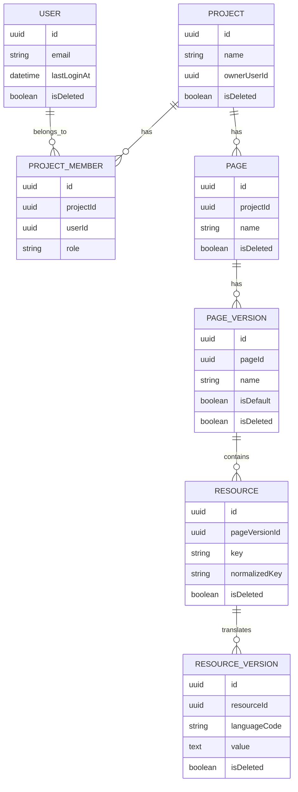

# Especificaciones funcionales priorizadas — Gestor de recursos (versión simplificada)

## 1) Objetivo del producto

Construir un software para centralizar textos de interfaz, organizarlos por proyecto y versión de página, traducirlos por idioma y exportarlos para desarrollo en JSON o XML.

La primera versión prioriza una jerarquía directa y predecible. Cada recurso pertenece a una única versión de página y cada versión de recurso contiene el texto de un idioma.

## 2) Alcance funcional

### Incluido

- Autenticación social y compartición de proyectos.
- Gestión de proyectos, páginas y versiones de página.
- Gestión de recursos dentro de una única versión de página.
- Traducciones de cada recurso mediante versiones identificadas por idioma.
- Catálogo inicial de idiomas fijo y extensible.
- OCR al crear una página desde una imagen.
- Detección de recursos duplicados dentro de una versión de página.
- Exportación JSON/XML a nivel de proyecto, página, versión de página o recurso.
- Traducción automática de todos los idiomas pendientes mediante OpenAI Responses API.

### Fuera de alcance en esta versión

- Asociación de un recurso con varias páginas o versiones de página.
- Entidades `ResourcePage`, `ResourceText`, `Language` y `ProjectLanguage`.
- Configuración de idiomas por proyecto desde la interfaz.
- Flujos avanzados de revisión editorial.
- Memoria de traducción avanzada, glosarios y revisión editorial.

## 3) Modelo de dominio y relaciones

### 3.1 Entidades principales

1. **User**: identifica al usuario autenticado y mantiene su último acceso.
2. **Project**: contenedor principal de páginas y miembros.
3. **ProjectMember**: asocia usuarios con proyectos y define su rol.
4. **Page**: pantalla o sección funcional que pertenece a un proyecto.
5. **PageVersion**: versión de una página que contiene sus propios recursos. Cada página mantiene exactamente una versión activa por defecto.
6. **Resource**: clave conceptual de un texto. Pertenece obligatoriamente a una única `PageVersion` y no se comparte con otras páginas.
7. **ResourceVersion**: texto de un recurso para un idioma. Contiene `languageCode` y `value`.

### 3.2 Cardinalidades

- `Project 1..N Page`
- `Project 1..N ProjectMember`
- `Page 1..N PageVersion`
- `PageVersion 1..N Resource`
- `Resource 1..N ResourceVersion`

### 3.3 Diagrama

```mermaid
erDiagram
    USER ||--o{ PROJECT_MEMBER : belongs_to
    PROJECT ||--o{ PROJECT_MEMBER : has
    PROJECT ||--o{ PAGE : has
    PAGE ||--o{ PAGE_VERSION : has
    PAGE_VERSION ||--o{ RESOURCE : contains
    RESOURCE ||--o{ RESOURCE_VERSION : translates

    USER {
      uuid id
      string email
      datetime lastLoginAt
      boolean isDeleted
    }
    PROJECT {
      uuid id
      string name
      uuid ownerUserId
      boolean isDeleted
    }
    PROJECT_MEMBER {
      uuid id
      uuid projectId
      uuid userId
      string role
    }
    PAGE {
      uuid id
      uuid projectId
      string name
      boolean isDeleted
    }
    PAGE_VERSION {
      uuid id
      uuid pageId
      string name
      boolean isDefault
      boolean isDeleted
    }
    RESOURCE {
      uuid id
      uuid pageVersionId
      string key
      string normalizedKey
      boolean isDeleted
    }
    RESOURCE_VERSION {
      uuid id
      uuid resourceId
      string languageCode
      text value
      boolean isDeleted
    }
```

## 4) Catálogo de idiomas

El catálogo inicial contiene:

| Código | Nombre | Bandera |
| --- | --- | --- |
| `pt-br` | Português (Brasil) | Brasil |
| `es-es` | Español | España |
| `en-uk` | English (United Kingdom) | Reino Unido |

Reglas:

- Los códigos siguen el formato BCP-47 y se almacenan en minúsculas.
- El backend valida los códigos contra un catálogo centralizado.
- El frontend presenta un desplegable con bandera, código y nombre.
- Las banderas son archivos SVG locales del frontend, no dependencias remotas.
- El catálogo inicial no impone un máximo de tres idiomas. Se pueden añadir códigos sin modificar el modelo de datos.
- No puede repetirse `(resourceId, languageCode)` entre versiones activas.

## 5) Reglas de negocio

1. **Acceso**
   - Solo el propietario y los miembros activos pueden acceder al proyecto.
   - Los roles con permiso de edición pueden modificar la jerarquía.
   - Cada login correcto actualiza `User.lastLoginAt`.

2. **Versiones de página**
   - Cada página tiene exactamente una `PageVersion` activa marcada como predeterminada.

3. **Pertenencia del recurso**
   - Todo `Resource` tiene un `pageVersionId` obligatorio.
   - El recurso solo es visible dentro de esa versión de página.
   - No existe una operación para vincular un recurso existente a otra página.

4. **Creación del recurso**
   - Crear un recurso exige `key`, `languageCode` y `value`.
   - La descripción es opcional.
   - El recurso y su primera `ResourceVersion` se guardan atómicamente.
   - Si falla cualquier validación, no se persiste ninguna entidad.

5. **Versiones por idioma**
   - `ResourceVersion` no tiene nombre libre ni estado predeterminado.
   - El idioma se escoge en el catálogo disponible.
   - Un recurso puede tener tantas versiones como idiomas admita el catálogo, pero solo una por idioma.
   - Al añadir una versión, la interfaz excluye los idiomas que ya utiliza el recurso.

6. **Detección de duplicados**
   - Al crear un recurso se buscan claves normalizadas duplicadas dentro de la misma `PageVersion`.

7. **Borrado lógico**
   - Las entidades con `isDeleted=true` no aparecen en los listados.
   - Al borrar una versión de página, sus recursos y versiones dejan de ser accesibles.

8. **Consistencia jerárquica**
   - Los identificadores de proyecto, página, versión de página y recurso deben pertenecer al mismo árbol.
   - Una jerarquía incoherente se rechaza sin modificar datos.

## 6) Propiedades por entidad

### Project
- `id`, `name`, `description?`, `ownerUserId`, `createdAt`, `updatedAt`, `isDeleted`

### User
- `id`, `email`, `lastLoginAt`, `createdAt`, `updatedAt`, `isDeleted`

### ProjectMember
- `id`, `projectId`, `userId`, `role` (`viewer|editor|admin`), `createdAt`, `updatedAt`, `isDeleted`

### Page
- `id`, `projectId`, `name`, `description?`, `createdAt`, `updatedAt`, `isDeleted`

### PageVersion
- `id`, `pageId`, `name`, `isDefault`, `createdAt`, `updatedAt`, `isDeleted`

### Resource
- `id`, `pageVersionId`, `key`, `normalizedKey`, `description?`, `createdAt`, `updatedAt`, `isDeleted`

### ResourceVersion
- `id`, `resourceId`, `languageCode`, `value`, `createdAt`, `updatedAt`, `isDeleted`

## 7) Funcionalidades priorizadas

### P0 — Imprescindibles

1. Autenticación social y perfil básico.
2. Home pública de producto.
3. Gestión de proyectos, miembros y roles mínimos.
4. CRUD de páginas y versiones de página, incluida la versión predeterminada.
5. CRUD de recursos dentro de una versión de página.
6. Creación atómica del recurso con su primera traducción.
7. Gestión de traducciones mediante `ResourceVersion` e idioma.
8. Detección de claves duplicadas dentro de la versión de página.
9. Control de acceso y validación completa de la jerarquía.

### P1 — Alta prioridad

10. Creación de página desde imagen mediante OCR y confirmación manual.
11. Exportación JSON/XML por proyecto, página, versión de página o recurso.
12. Búsqueda por proyecto, página, recurso e idioma.
13. Traducción automática de los idiomas pendientes de un recurso mediante OpenAI Responses API.

### P2 — Prioridad media

14. Historial y auditoría.
15. Estados de revisión para traducciones.

### P3 — Evolutivo

16. Catálogo de idiomas administrable.
17. Permisos granulares.
18. Exportaciones programadas o mediante API.

## 8) Casos de uso clave

1. El usuario inicia sesión y crea un proyecto.
2. Comparte el proyecto con otro usuario.
3. Crea una página y una versión de página predeterminada.
4. Entra en una versión de página y crea un recurso.
5. Selecciona el idioma inicial y escribe el valor traducido.
6. El sistema crea el recurso y la primera traducción atómicamente.
7. Entra en el recurso y añade traducciones para otros idiomas disponibles.
8. Como alternativa, selecciona una traducción existente y genera automáticamente todos los idiomas pendientes.
9. El sistema valida la respuesta y guarda todas las traducciones generadas o ninguna.
10. Exporta los recursos en JSON o XML.

## 9) Criterios de aceptación mínimos

- Un usuario no compartido no puede acceder al proyecto.
- Una página puede mantener varias versiones y una única predeterminada activa.
- Todo recurso pertenece a una única versión de página.
- No existe ninguna entidad, ruta o interfaz funcional de `ResourcePage`.
- Crear un recurso crea también su primera traducción o no crea ningún dato.
- El idioma se selecciona mediante un desplegable con banderas locales.
- Inicialmente están disponibles `pt-br`, `es-es` y `en-uk`.
- No se puede crear dos veces el mismo idioma para un recurso.
- El catálogo puede crecer sin cambiar la estructura de la base de datos.
- Los IDs jerárquicamente incoherentes son rechazados.
- El usuario puede elegir una traducción existente como origen y generar todos los idiomas pendientes.
- La generación automática se guarda de forma atómica y nunca sobrescribe traducciones existentes.
- El navegador nunca se conecta directamente a OpenAI ni contiene la API key.

## 10) URLs del sistema

Ruta base jerárquica:

`/projects/{projectId}/{pageId}/{pageVersionId}/{resourceId}`

Niveles:

1. `/projects` → listado de proyectos.
2. `/projects/{projectId}` → páginas del proyecto.
3. `/projects/{projectId}/{pageId}` → versiones de la página.
4. `/projects/{projectId}/{pageId}/{pageVersionId}` → recursos de la versión de página.
5. `/projects/{projectId}/{pageId}/{pageVersionId}/{resourceId}` → traducciones del recurso.

No existe un nivel adicional de asociación entre recurso y página.

## 11) Contrato REST principal

### Recursos

- `GET|POST /api/v1/projects/{projectId}/pages/{pageId}/versions/{pageVersionId}/resources`
- `PUT|DELETE /api/v1/projects/{projectId}/pages/{pageId}/versions/{pageVersionId}/resources/{resourceId}`

El `POST` recibe `key`, `description?`, `languageCode` y `value`.

### Versiones de recurso por idioma

- `GET|POST /api/v1/projects/{projectId}/pages/{pageId}/versions/{pageVersionId}/resources/{resourceId}/versions`
- `PUT|DELETE /api/v1/projects/{projectId}/pages/{pageId}/versions/{pageVersionId}/resources/{resourceId}/versions/{resourceVersionId}`

El `POST` recibe `languageCode` y `value`. No existe una operación `set-default` para `ResourceVersion`.

### Traducciones automáticas

- `POST /api/v1/projects/{projectId}/pages/{pageId}/versions/{pageVersionId}/resources/{resourceId}/automatic-translations`

El `POST` recibe únicamente `sourceLanguageCode`. La API carga el valor de origen, calcula todos los idiomas pendientes, invoca OpenAI Responses API con Structured Outputs y guarda la respuesta completa en una única transacción. Una respuesta parcial o inválida no produce cambios. El contrato detallado, la configuración de OpenAI y la gestión de credenciales se definen en `docs/05-automatic-translates/SPEC.md`.

## 12) Persistencia y migración

- Se elimina la tabla de asociación entre recursos y versiones de página.
- `Resources.ProjectId` se reemplaza por `Resources.PageVersionId` obligatorio.
- `ResourceVersions.Name` se reemplaza por `ResourceVersions.LanguageCode`.
- Se elimina `ResourceVersions.IsDefault`.
- Se crea un índice único para `(ResourceId, LanguageCode)`.
- La base de desarrollo se elimina y se recrea; no se migran los datos anteriores.

## 13) Estrategia de implementación

La implementación se realizará de extremo a extremo en backend y frontend mediante ciclos Red → Green → Refactor:

1. Pruebas API de esquema, jerarquía, permisos, atomicidad, idiomas y duplicados.
2. Modelo EF, contratos, servicios y controladores.
3. Pruebas frontend de navegación y selectores de idioma.
4. Cliente API, rutas, vistas, formularios y banderas locales.
5. Regresión completa de API y frontend, build, lint y validación visual responsive.
